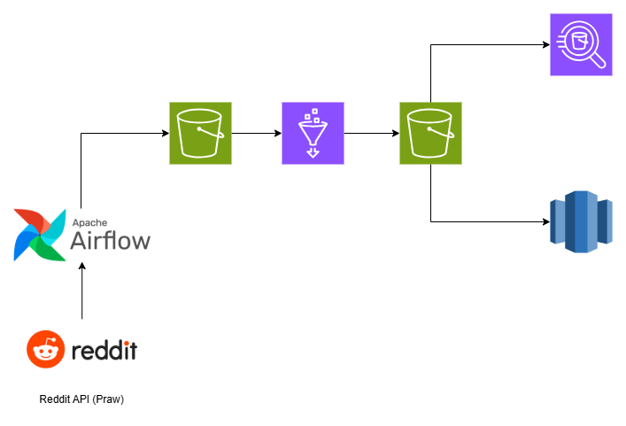

# Reddit Data Warehouse & Analytics Pipeline 🚀

An end-to-end automated data pipeline that extracts Reddit data, stages it in AWS S3, transforms it using AWS Glue, and loads it into Redshift for scalable analytics. The pipeline is orchestrated with Apache Airflow to ensure robust scheduling, dependency management, and observability.

---

## 📌 Project Highlights

- **Automated ETL Workflow** using Apache Airflow
- **Scalable Data Storage** in AWS S3
- **Schema Inference & Cataloging** with AWS Glue
- **Data Warehousing** in AWS Redshift
- **Query-ready Analytics Layer** for dashboards and insights

---

## 🛠️ Tech Stack

- **Python**
- **Apache Airflow**
- **AWS S3**
- **AWS Glue**
- **AWS Redshift**
- **Reddit API (PRAW)**

---

## ☁️ Project Architecture

